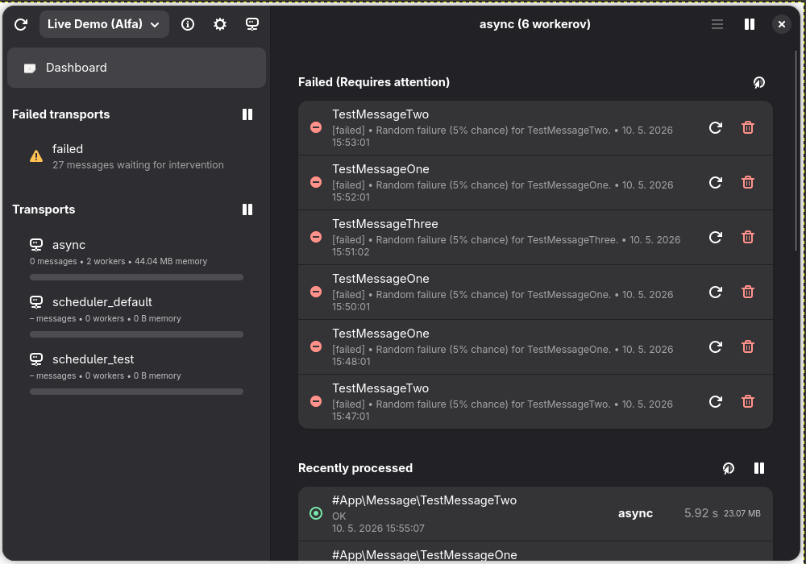

# RespatchBundle

**RespatchBundle** is a Symfony bundle that provides an API for the **Respatch** desktop application.

## What is Respatch?

Respatch is a native Linux application designed for developers and administrators who need a complete overview of what's happening in their Symfony Messenger. No more constantly refreshing web interfaces – Respatch brings you important information in real time, directly in your desktop environment.

[](docs/main-screen.png)

For more information about the desktop application, visit [https://github.com/mostka-sk/respatch-gnome/](https://github.com/mostka-sk/respatch-gnome/).

## Installation

Make sure Composer is installed globally, as explained in the
[installation chapter](https://getcomposer.org/doc/00-intro.md)
of the Composer documentation.

### Applications that use Symfony Flex

Open a command console, enter your project directory and execute:

```console
$ composer require mostka-sk/respatch-bundle
```

> **Note:** If the routes are not automatically registered by Symfony Flex, you will need to create the `config/routes/respatch.yaml` file manually as described in **Step 3** below.

### Applications that don't use Symfony Flex

#### Step 1: Download the Bundle

Open a command console, enter your project directory and execute the
following command to download the latest stable version of this bundle:

```console
$ composer require mostka-sk/respatch-bundle
```

#### Step 2: Enable the Bundle

Then, enable the bundle by adding it to the list of registered bundles
in the `config/bundles.php` file of your project:

```php
// config/bundles.php

return [
    // ...
    MostkaSk\RespatchBundle\RespatchBundle::class => ['all' => true],
];
```

#### Step 3: Register Routes

Create the `config/routes/respatch.yaml` file to register the bundle's routes:

```yaml
respatch_api:
    resource: '@RespatchBundle/config/routes.php'
    prefix: /_respatch/api
```

## Configuration

For the desktop application to communicate with your Symfony server, you need to set a security token. 
To ensure security, the token stored on the server in `.env.local` must be a **SHA-256 hash** of your actual token. 
**Note:** The Respatch desktop application itself expects the **original plain text token**, not the hash!

1. Generate a SHA-256 hash of your chosen secret plain text token. You can do this via the command line:

```console
$ php -r "echo hash('sha256', 'my_super_secret_token_123') . PHP_EOL;"
# Output: 818981442c8d28c347dd9c97b819619c62985f540b6cd6e6f157ad3d21b01775
```

2. Add the hashed value to your `.env` or `.env.local` file:

```env
RESPATCH_TOKEN=818981442c8d28c347dd9c97b819619c62985f540b6cd6e6f157ad3d21b01775
```

3. Create the `config/packages/respatch.yaml` file to pass this token to the bundle:

```yaml
respatch:
    token: '%env(RESPATCH_TOKEN)%'
```

## Security

To protect your data, you must configure a firewall for the Respatch API in `config/packages/security.yaml`.

Add the `respatch_api` firewall **before** your `main` firewall to ensure it has priority:

```yaml
# config/packages/security.yaml
security:
    firewalls:
        respatch_api:
            pattern: ^/_respatch/api
            stateless: true
            custom_authenticators:
                - respatch.authenticator
        
        # Make sure it's above your main firewall
        main:
            # ...
```

This configuration ensures that all requests starting with `/_respatch/api` are authenticated using the token you provided in the configuration.
